# Manual de utilizare USG

**USG -- Evidența investigațiilor ecografice**\
**Versiune documentată:** 4.2.9\
**Platforme:** Linux / Windows\
**Interfață:** Română / Русский

> \[!NOTE\] Acest manual descrie utilizarea aplicației USG din
> perspectiva medicului și a operatorului. Configurarea serverului,
> compilarea aplicației și dezvoltarea surselor nu fac parte din acest
> manual.

------------------------------------------------------------------------

## Cuprins

1. [Despre aplicație](#1-despre-aplicație)
2. [Pornirea aplicației](#2-pornirea-aplicației)
3. [Configurarea inițială](#3-configurarea-inițială)
4. [Autentificarea](#4-autentificarea)
5. [Fereastra principală](#5-fereastra-principală)
6. [Cataloage](#6-cataloage)
7. [Programarea pacienților](#7-programarea-pacienților)
8. [Pacienți și istoricul
   pacientului](#8-pacienți-și-istoricul-pacientului)
9. [Comanda ecografică](#9-comanda-ecografică)
10. [Consimțământul informat](#10-consimțământul-informat)
11. [Jurnalul comenzilor](#11-jurnalul-comenzilor)
12. [Raportul ecografic](#12-raportul-ecografic)
13. [Imagini și video](#13-imagini-și-video)
14. [Normograme](#14-normograme)
15. [Jurnalul rapoartelor](#15-jurnalul-rapoartelor)
16. [Tipărire și export PDF](#16-tipărire-și-export-pdf)
17. [Expedierea prin e-mail](#17-expedierea-prin-e-mail)
18. [Prețuri](#18-prețuri)
19. [Rapoarte și statistici](#19-rapoarte-și-statistici)
20. [Setările aplicației](#20-setările-aplicației)
21. [SQLite, MariaDB și
    sincronizare](#21-sqlite-mariadb-și-sincronizare)
22. [Copii de siguranță](#22-copii-de-siguranță)
23. [Actualizarea aplicației](#23-actualizarea-aplicației)
24. [Scurtături de tastatură](#24-scurtături-de-tastatură)
25. [Recomandări de utilizare](#25-recomandări-de-utilizare)
26. [Soluționarea problemelor](#26-soluționarea-problemelor)
27. [Confidențialitatea datelor](#27-confidențialitatea-datelor)

------------------------------------------------------------------------

## 1. Despre aplicație

USG este o aplicație desktop pentru evidența investigațiilor ecografice.
Aplicația este destinată medicilor, cabinetelor medicale și clinicilor
mici și permite gestionarea fluxului de lucru de la programarea
pacientului până la emiterea raportului ecografic.

Funcțiile principale includ:

- evidența pacienților;
- programarea pacienților;
- întocmirea Comenzilor ecografice;
- întocmirea Rapoartelor ecografice structurate;
- păstrarea istoricului investigațiilor;
- atașarea imaginilor și fișierelor video;
- generarea automată a textului pentru consimțământul informat;
- tipărirea documentelor;
- exportul documentelor în PDF;
- expedierea documentelor și imaginilor prin e-mail;
- evidența organizațiilor, medicilor și asistenților medicali;
- gestionarea investigațiilor și prețurilor;
- rapoarte statistice;
- utilizarea unei baze SQLite locale sau MariaDB;
- sincronizare opțională SQLite--MariaDB.

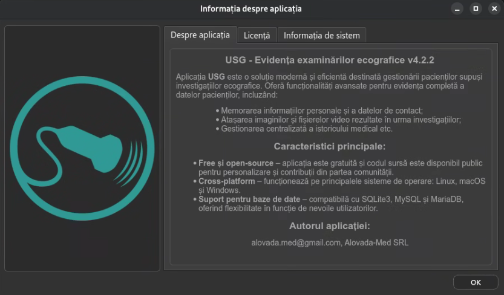

### Fluxul obișnuit de lucru

Fluxul recomandat este:

**Programare → Comandă ecografică → Raport ecografic → Validare →
Tipărire / PDF / E-mail**

O Comandă poate fi creată și fără o programare prealabilă.

> [!NOTE]
> Pentru reducerea erorilor de introducere, utilizați pacientul existent din baza de date atunci când acesta s-a adresat anterior.

------------------------------------------------------------------------

## 2. Pornirea aplicației

La pornire, USG inițializează configurația, verifică baza de date și
pregătește mediul de lucru.

În funcție de configurație, aplicația poate:

- verifica existența unei versiuni noi;
- solicita selectarea profilului/bazei de date;
- solicita autentificarea utilizatorului;
- efectua actualizări ale structurii bazei de date;
- porni sincronizarea cu baza MariaDB configurată.

La prima pornire este disponibil asistentul de configurare inițială.

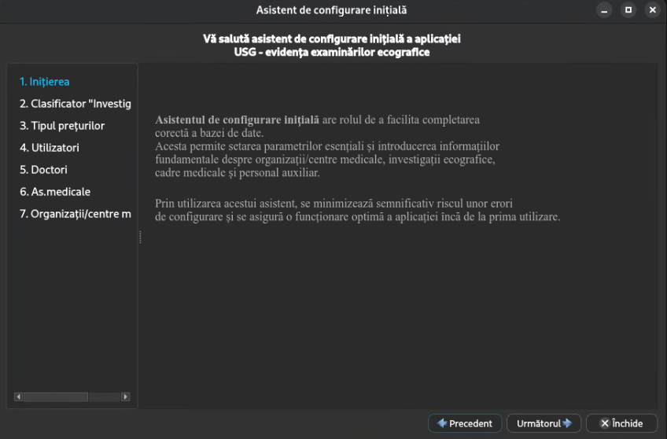

------------------------------------------------------------------------

## 3. Configurarea inițială

Asistentul de configurare inițială simplifică pregătirea aplicației
pentru prima utilizare.

Acesta permite configurarea cataloagelor esențiale, inclusiv:

- clasificatorul **Investigații**;
- catalogul **Tipul prețurilor**;
- **Utilizatori**;
- **Doctori**;
- **Asistenți medicali**;
- **Organizații / Centre medicale**.

Parcurgeți pașii cu butoanele **Precedent** și **Următorul**.

### 3.1. Clasificatorul investigațiilor

Încărcarea clasificatorului este importantă deoarece investigațiile sunt
utilizate în Comandă, calculul prețurilor, formarea raportului și
selectarea tipului de consimțământ informat.

> \[!IMPORTANT\] Înainte de utilizarea în producție verificați
> cataloagele, organizația, medicul implicit, tipurile de preț și
> investigațiile disponibile.

------------------------------------------------------------------------

## 4. Autentificarea

Fereastra de autentificare conține câmpurile:

- **Login**;
- **Parola**;
- opțiunea **Memorează**;
- informația despre ultima accesare.

Introduceți datele utilizatorului și apăsați **OK**.

Numele de utilizator nu ține cont de majuscule: „Admin” și „admin”
desemnează același utilizator, iar doi utilizatori nu pot avea același
nume. Parola face diferența între majuscule și minuscule.

Parolele noi sau schimbate trebuie să aibă cel puțin 8 caractere. După 3
încercări nereușite pentru același nume, autentificarea este suspendată
temporar (30 de secunde, apoi tot mai mult, până la 5 minute); butonul
**OK** afișează timpul rămas. Mesajul de eroare nu precizează dacă
greșit este numele sau parola. Dacă ați uitat parola, adresați-vă
administratorului.

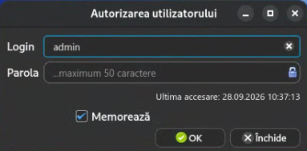

### Blocarea aplicației

Din fereastra principală este disponibilă funcția **Blocare**.
Utilizați-o când părăsiți temporar stația de lucru, mai ales dacă
aplicația conține date reale ale pacienților.

------------------------------------------------------------------------

## 5. Fereastra principală

Fereastra principală oferă acces la funcțiile aplicației prin meniu și
bara de instrumente.

Meniurile principale sunt:

- **File**;
- **Cataloage**;
- **Documente**;
- **Setări**;
- **Asistență**;
- **Rapoarte**.

Accesul rapid include funcții precum:

- Doctori;
- Asistenți medicali;
- Pacienți;
- Istoria pacientului;
- Utilizatori;
- Programarea;
- Comanda ecografică;
- Raport ecografic;
- Centre medicale;
- Investigații;
- Rapoarte;
- Prețuri;
- Setări;
- Despre aplicație;
- Blocare.

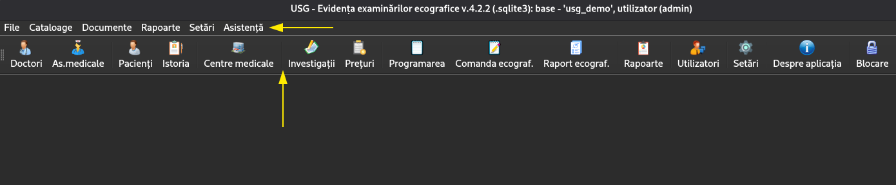

------------------------------------------------------------------------

## 6. Cataloage

Cataloagele conțin date reutilizate în documentele aplicației. Este
recomandată completarea lor înainte de lucrul curent.

În funcție de drepturile utilizatorului și configurație sunt disponibile
cataloage pentru:

- doctori;
- asistenți medicali;
- utilizatori;
- organizații / centre medicale;
- contracte;
- investigații;
- grupe de investigații;
- tipuri de preț;
- conturi online/e-mail.

### 6.1. Doctori și asistenți medicali

Înregistrați persoanele care vor apărea în documente. Doctorul și
asistentul medical pot fi selectați ulterior ca valori implicite în
Setări.

### 6.2. Organizații / Centre medicale

Catalogul organizațiilor este utilizat în documente, contracte, filtre,
prețuri și formularele de tipar.

Pentru organizația de lucru pot fi configurate informații care apar pe
documentele tipărite, inclusiv logotipul.

### 6.3. Investigații

Catalogul investigațiilor reprezintă baza pentru selectarea serviciilor
în Comanda ecografică.

Codurile investigațiilor sunt utilizate și pentru determinarea automată
a categoriei de consimțământ informat.

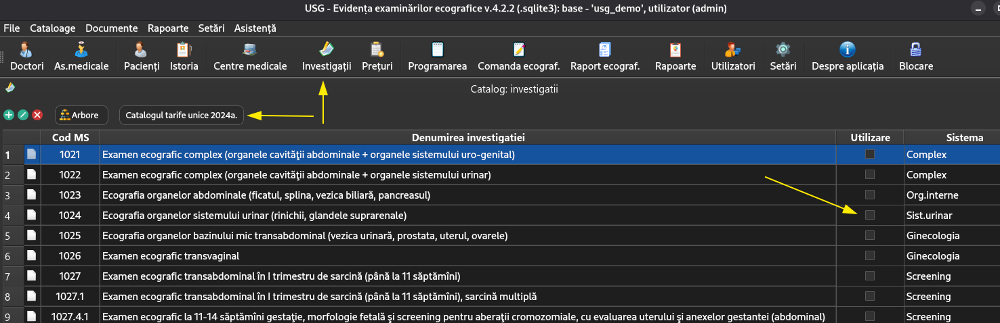

------------------------------------------------------------------------

## 7. Programarea pacienților

Deschideți **Programarea pacienților** din fereastra principală.

Programările sunt organizate pe intervale de timp. În configurația
standard aplicația utilizează intervale de 15 minute.

Pentru o programare:

1. selectați data;
2. selectați intervalul orar;
3. introduceți sau selectați pacientul;
4. completați investigația/investigațiile și informațiile necesare;
5. salvați modificările.

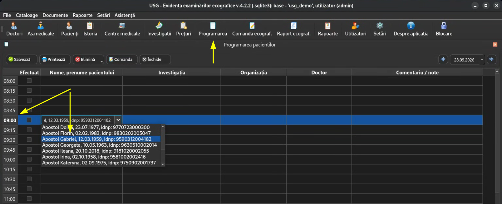

### 7.1. Crearea Comenzii din programare

Selectați programarea dorită și utilizați funcția de creare a Comenzii.

Aplicația verifică existența datelor minime ale pacientului înainte de
crearea documentului.

### 7.2. Eliminarea unei programări

Selectați programarea și utilizați **Elimină**. Aplicația solicită
confirmarea operației.

> \[!NOTE\] Eliminarea unei programări nu trebuie confundată cu
> eliminarea documentelor medicale deja create.

### 7.3. Tipărirea programărilor

Butonul **Printează** deschide forma de tipar a programărilor din ziua
selectată (A4 orizontal). Forma conține antetul organizației (logotipul
sau denumirea și datele de contact), data și ziua săptămânii, tabelul
programărilor (ora, pacientul, investigațiile, organizația, doctorul,
comentariul, mențiunea „Efectuat”), numărul total de pacienți programați
și numele medicului.

Se tipăresc numai intervalele care au pacient, așa cum sunt afișate în
fereastră, inclusiv modificările încă nesalvate. Dacă în preferințe este
activat meniul extins de tipărire, butonul oferă și deschiderea
designerului formei.

------------------------------------------------------------------------

## 8. Pacienți și istoricul pacientului

Catalogul pacienților păstrează datele de identificare și permite
reutilizarea acestora la adresările ulterioare.

Datele disponibile în documente includ, după caz:

- numele pacientului;
- anul/data nașterii;
- IDNP;
- polița;
- adresa;
- telefonul;
- e-mailul;
- alte informații utilizate de document.

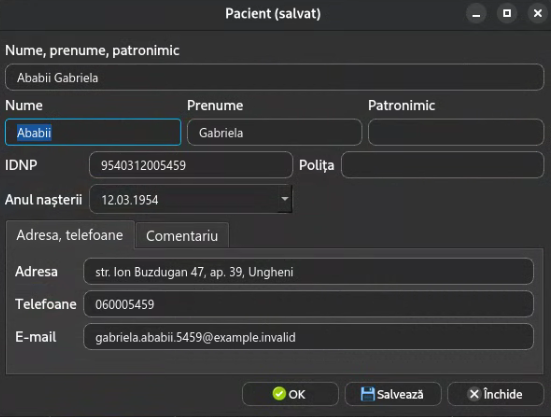

### Căutarea și eliminarea pacientului din catalog

În catalogul Pacienți, câmpul **Căutare pacient** din bara de
instrumente (`Ctrl+F`) filtrează lista după nume, prenume, IDNP sau data
nașterii (zz.ll.aaaa); se pot introduce mai multe cuvinte, de exemplu
familia și prenumele. `Esc` golește câmpul.

Butonul de eliminare din bara de instrumente deschide un meniu:

- **Marcare pentru eliminare** (sau tasta `Delete`) -- pacientul rămâne
  în baza de date, marcat; repetarea comenzii anulează marcarea;
- **Eliminare din baza de date** (sau `Shift+Delete`) -- pacientul este
  șters definitiv, numai dacă nu este folosit în Comenzi, Rapoarte sau
  programări. Altfel aplicația afișează lista documentelor care îl
  folosesc.

Aceleași comenzi sunt disponibile în meniul contextual al listei.

> \[!WARNING\] Eliminarea din baza de date nu poate fi anulată. Creați o
> copie de siguranță înainte de curățarea catalogului.

### 8.1. Istoria adresărilor

Funcția **Istoria** permite consultarea investigațiilor anterioare ale
pacientului.

Fereastra poate afișa:

- istoricul adresărilor;
- diagnosticul/concluziile;
- imaginile atașate investigațiilor anterioare.

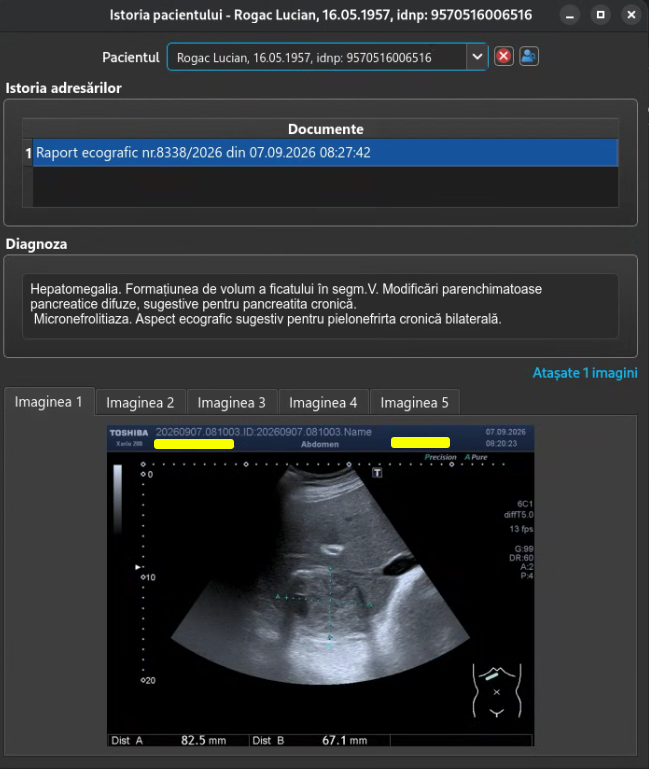

> \[!TIP\] Consultați istoricul înainte de examinare atunci când
> comparația cu investigațiile precedente este relevantă clinic.

------------------------------------------------------------------------

## 9. Comanda ecografică

Comanda ecografică înregistrează investigațiile solicitate și datele
administrative ale adresării.

Fereastra include următoarele grupuri principale:

- datele organizației;
- tipul prețurilor;
- asistentul medical;
- medicul care a trimis pacientul;
- organizația;
- contractul;
- datele pacientului;
- investigațiile solicitate;
- comentariul;
- informațiile privind plata.

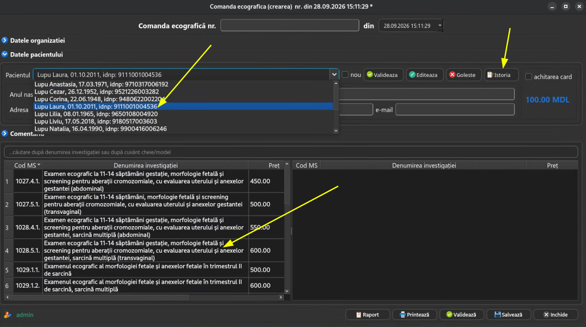

### 9.1. Datele pacientului

În zona pacientului pot fi completate sau consultate:

- pacientul;
- polița;
- IDNP;
- adresa;
- telefonul;
- e-mailul;
- anul nașterii.

Sunt disponibile acțiuni precum:

- **Validează**;
- **Editează**;
- **Golește**;
- **Istoria**.

### 9.2. Investigațiile solicitate

Selectați una sau mai multe investigații din clasificator.

Investigațiile selectate influențează:

- valoarea Comenzii;
- sistemele disponibile/relevante în Raport;
- textul consimțământului informat;
- documentul tipărit.

### 9.3. Salvarea și validarea

În partea de jos a ferestrei sunt disponibile:

- **Validează**;
- **Salvează**;
- **Printează**;
- **Raport**;
- **Închide**.

**Salvează** păstrează modificările documentului.

**Validează** finalizează documentul conform fluxului aplicației.

**Raport** deschide/creează Raportul ecografic asociat Comenzii.

> \[!IMPORTANT\] Verificați datele pacientului și investigațiile
> selectate înainte de validare și tipărire.

------------------------------------------------------------------------

## 10. Consimțământul informat

În USG 4.2.x, textul consimțământului informat al Comenzii este generat
automat în funcție de codurile investigațiilor selectate.

Sunt utilizate patru categorii:

1. **investigații invazive**;
2. **investigații neinvazive**;
3. **investigații endocavitare**;
4. **screening obstetrical / sarcină**.

Pentru investigațiile endocavitare aplicația diferențiază, după codul
investigației, examinările transvaginale și transrectale.

Pentru screeningul obstetrical textul conține informații specifice
examinării sarcinii și utilizării modurilor Doppler.

> \[!IMPORTANT\] Categoria consimțământului depinde de clasificarea
> codului investigației. După modificarea clasificatorului, verificați
> documentul rezultat înainte de utilizarea clinică.

------------------------------------------------------------------------

## 11. Jurnalul comenzilor

Fereastra Comenzilor permite căutarea și filtrarea documentelor
existente.

Filtrele includ:

- perioada;
- numărul documentului;
- contractul;
- autorul;
- organizația.

Sunt disponibile acțiuni pentru:

- deschiderea Comenzii;
- tipărirea Comenzii;
- deschiderea Raportului asociat;
- tipărirea Raportului;
- salvarea setărilor filtrului;
- aplicarea sau golirea filtrului.

Dacă Raportul asociat lipsește, aplicația indică explicit acest lucru.

### Căutarea în jurnal

Butonul de căutare din bara de instrumente (`Ctrl+F`) afișează sau
ascunde câmpul de căutare de deasupra jurnalului. Criteriul se alege din
meniul butonului din stânga câmpului:

- **după pacient** – nume, prenume (în orice ordine) sau începutul
  IDNP-ului;
- **după investigație** – codul sau denumirea; în timpul tastării apare
  lista investigațiilor folosite care conțin textul introdus, iar
  investigația aleasă din listă afișează comenzile care o conțin.

Jurnalul se filtrează pe măsura tastării, în perioada și cu filtrele
aplicate. `Esc` în câmpul de căutare sau o nouă apăsare a butonului
ascunde câmpul și anulează căutarea.

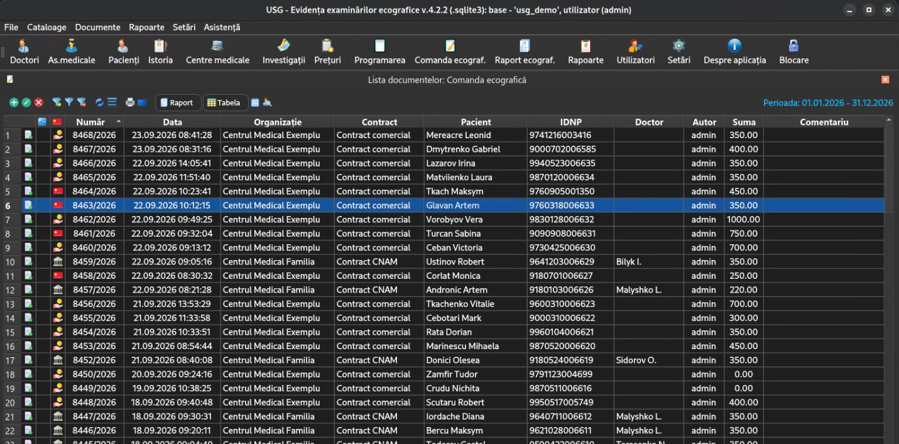

------------------------------------------------------------------------

## 12. Raportul ecografic

Raportul ecografic este documentul medical principal al examinării.

Fereastra Raportului conține:

- numărul și data documentului;
- pacientul;
- legătura cu Comanda ecografică;
- paginile sistemelor examinate;
- comentariul;
- concluzia;
- opțiunile raportului.

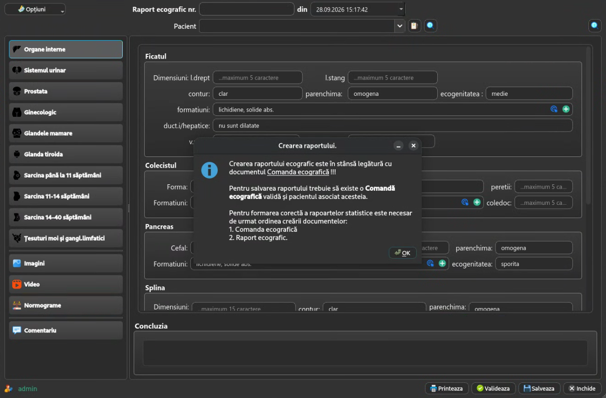

### 12.1. Sisteme și pagini disponibile

Raportul include pagini dedicate pentru:

- **Organe interne**;
- **Sistemul urinar**;
- **Prostata**;
- **Ginecologic**;
- **Glandele mamare**;
- **Glanda tiroidă**;
- **Sarcina până la 11 săptămâni**;
- **Sarcina 11--14 săptămâni**;
- **Sarcina 14--40 săptămâni**;
- **Țesuturi moi și ganglioni limfatici**;
- **Imagini**;
- **Video**;
- **Normograme**.

Completați numai secțiunile relevante pentru investigația efectuată.

### 12.2. Organe interne

Secțiunea este destinată descrierii structurate a organelor abdominale
examinate.

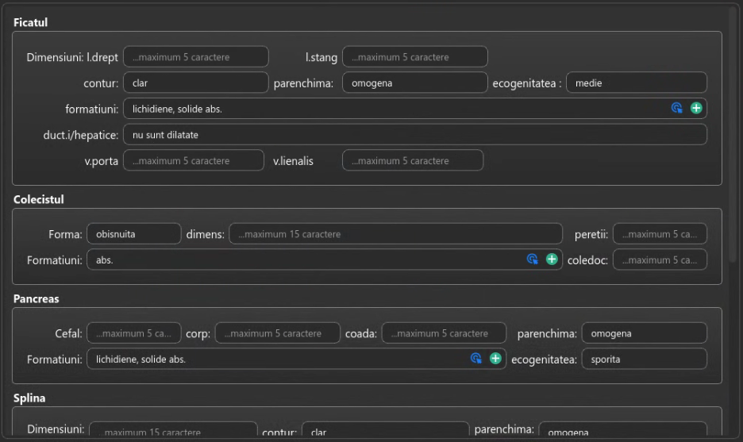

### 12.3. Sistemul urinar

Secțiunea este destinată examinării rinichilor, vezicii urinare și
parametrilor aferenți.

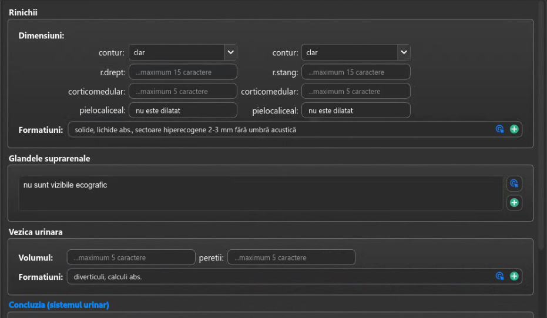

### 12.4. Prostata

Secțiunea conține parametrii utilizați la examinarea ecografică a
prostatei.

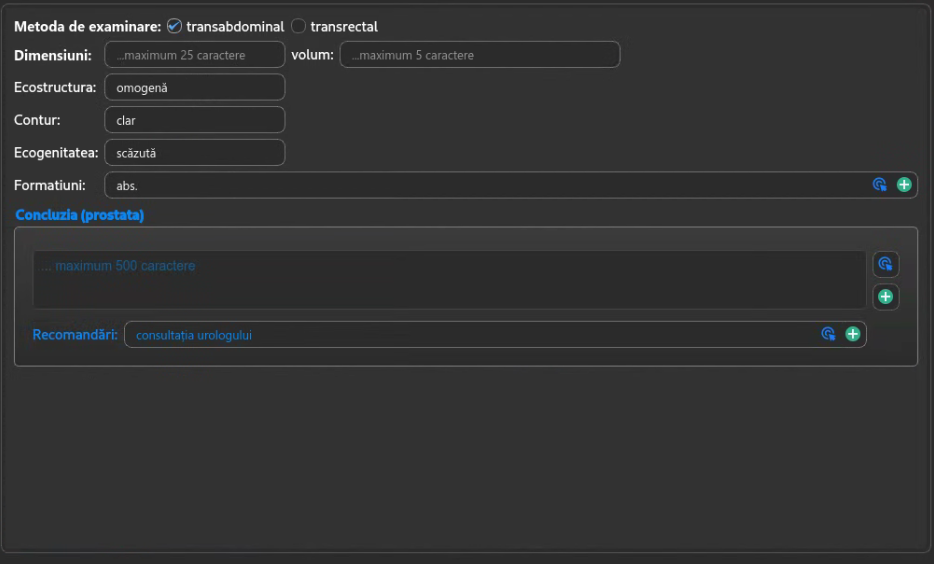

### 12.5. Ginecologic

Secțiunea este destinată examinării ginecologice, inclusiv examinărilor
relevante endocavitare.

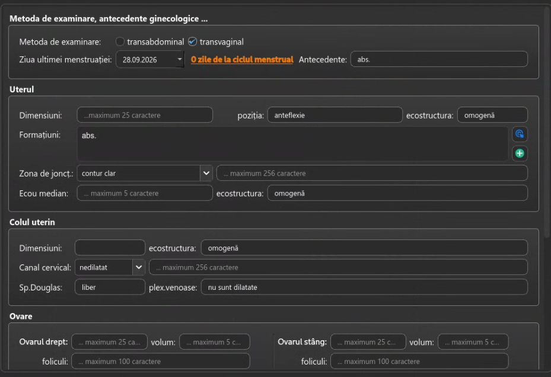

### 12.6. Glandele mamare

Secțiunea permite completarea structurată a examinării glandelor mamare.

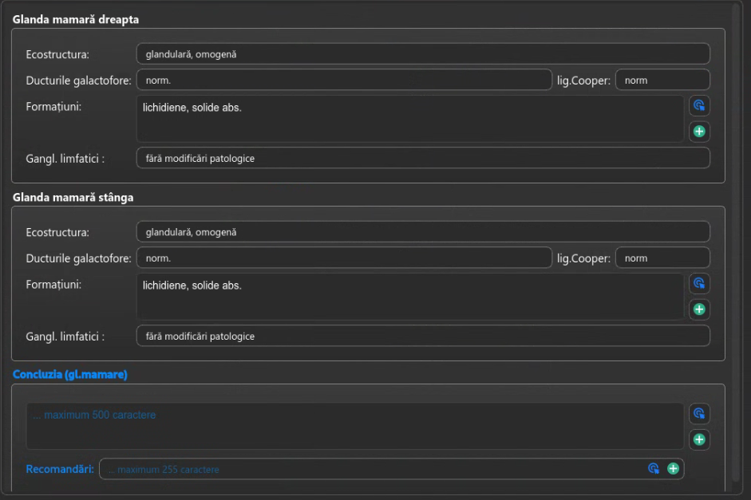

### 12.7. Glanda tiroidă

Secțiunea este destinată descrierii glandei tiroide și modificărilor
identificate.

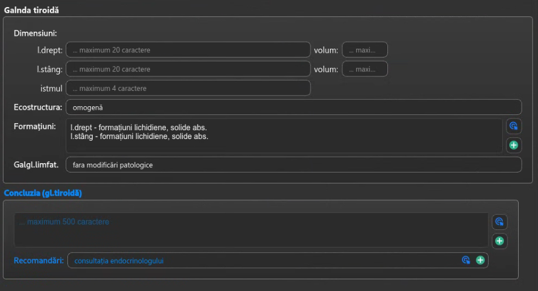

### 12.8. Sarcina

Pentru examinările obstetricale există trei pagini distincte:

- până la 11 săptămâni;
- 11--14 săptămâni;
- 14--40 săptămâni.

Utilizați pagina corespunzătoare vârstei gestaționale.

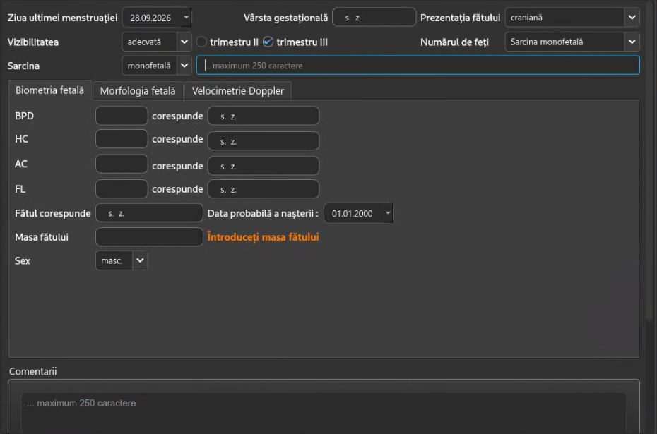

### 12.9. Țesuturi moi și ganglioni limfatici

Secțiunea este destinată examinărilor țesuturilor moi și ganglionilor
limfatici.

### 12.10. Comentariu și concluzie

La finalul examinării completați, după caz:

- **Comentariu**;
- **Concluzia**.

Concluzia trebuie verificată înainte de validarea Raportului.

### 12.11. Salvare, validare și tipărire

Acțiunile principale sunt:

- **Printează** -- `Ctrl+P`;
- **Validează** -- `Ctrl+Enter`;
- **Salvează** -- `Ctrl+S`;
- **Închide** -- `Esc`.

------------------------------------------------------------------------

## 13. Imagini și video

### 13.1. Imagini

Pagina **Imagini** permite atașarea imaginilor asociate examinării.

Imaginile pot fi utilizate ulterior în:

- istoricul pacientului;
- documentele tipărite, în funcție de șablon;
- expedierea prin e-mail.

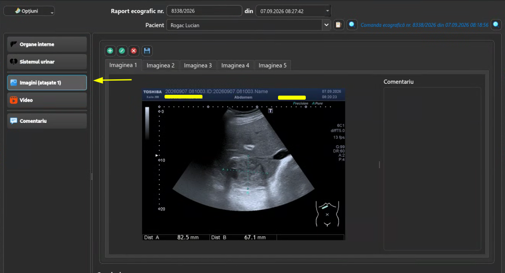

### 13.2. Video

Pagina **Video** permite asocierea fișierelor video cu examinarea.

Localizarea fișierelor video este configurabilă în setările aplicației.

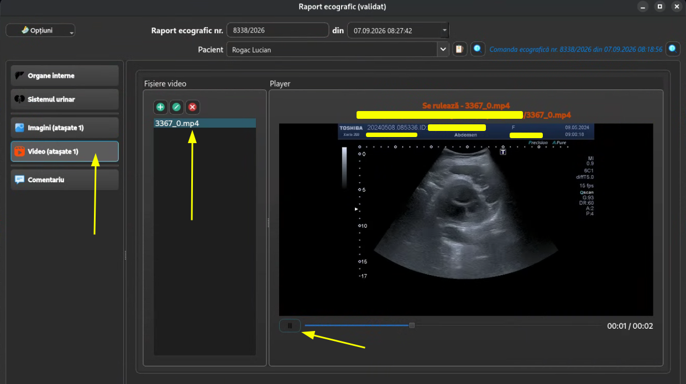

> \[!IMPORTANT\] Nu mutați manual bazele de imagini sau directoarele
> video ale unei instalări în producție fără a verifica setările
> aplicației și existența unei copii de siguranță.

------------------------------------------------------------------------

## 14. Normograme

Pagina **Normograme** oferă acces la instrumentele de referință
disponibile în aplicație.

Utilizați normogramele ca instrument auxiliar, conform contextului
clinic și parametrilor investigației.

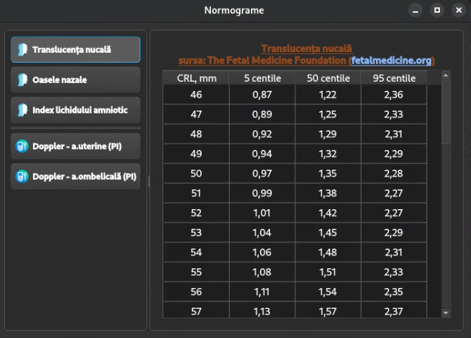

------------------------------------------------------------------------

## 15. Jurnalul rapoartelor

Jurnalul Rapoartelor permite căutarea documentelor existente.

Filtrarea poate fi efectuată după:

- perioadă;
- numărul documentului;
- contract;
- autor;
- organizație.

Din jurnal Raportul poate fi:

- deschis;
- tipărit.

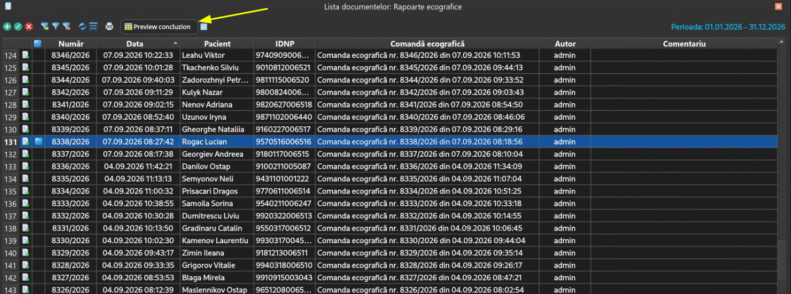

------------------------------------------------------------------------

## 16. Tipărire și export PDF

USG utilizează șabloane de tipar pentru formarea documentelor.

Fereastra de raportare oferă acțiuni precum:

- **Printează**;
- **Export PDF**;
- selectarea **Tipului raportului**;
- **Formează**;
- **Setări**;
- **Designer**;
- **E-mail**.

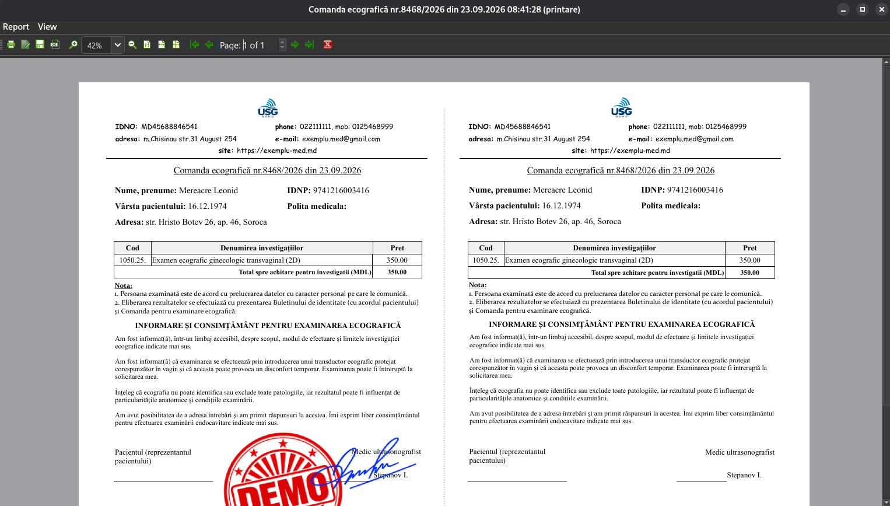

### 16.1. Opțiuni de formare

În funcție de document sunt disponibile opțiuni precum:

- organizația;
- doctorul;
- contractul;
- ascunderea logotipului;
- ascunderea semnăturii și ștampilei;
- ascunderea numelui doctorului;
- ascunderea datelor organizației;
- ascunderea prețurilor și totalurilor;
- formarea automată la deschidere.

### 16.2. Export PDF

Utilizați **Export PDF** pentru a salva documentul într-un fișier PDF.

Înainte de expediere verificați:

- identitatea pacientului;
- conținutul raportului;
- organizația;
- medicul;
- prezența/absența prețurilor;
- destinația fișierului.

------------------------------------------------------------------------

## 17. Expedierea prin e-mail

USG poate pregăti și expedia documente prin e-mail folosind un cont
configurat.

Fereastra de expediere conține:

- **Account**;
- **De la**;
- **Către**;
- **Subiect**;
- **Fișierele atașate**;
- **Imaginile atașate**;
- **Trimite**;
- **Închide**.

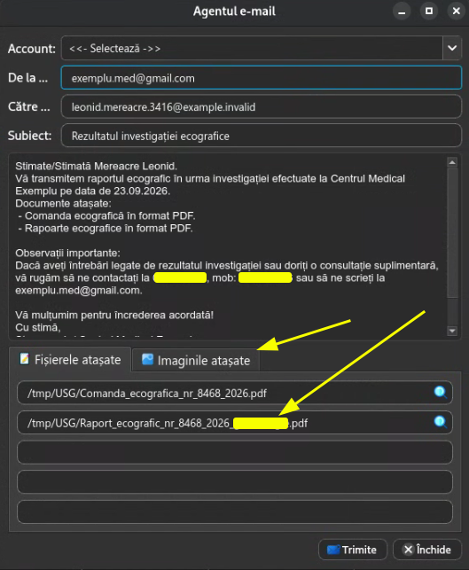

> \[!IMPORTANT\] Verificați adresa destinatarului și fișierele atașate
> înainte de apăsarea butonului **Trimite**. Documentele medicale conțin
> date confidențiale.

### Trimiterea mai multor rapoarte într-un e-mail

Rapoartele ecografice validate pot fi transmise într-o singură scrisoare
organizației (centrului de sănătate) care a trimis pacienții:

1. deschideți jurnalul **Rapoarte ecografice**;
2. opțional, selectați rapoartele dorite cu **Ctrl** sau **Shift**;
3. apăsați butonul de e-mail din bara de instrumente sau alegeți
   **Trimite rapoartele prin e-mail ...** din meniul contextual;
4. în fereastra de selecție alegeți organizația și perioada, bifați
   rapoartele și, dacă este necesar, includerea imaginilor;
5. confirmați; rapoartele se exportă în PDF și se deschide fereastra de
   expediere cu adresa organizației din catalog.

Se pot alege numai rapoarte validate. Dacă unele rapoarte nu pot fi
exportate, aplicația afișează cauza și întreabă dacă se continuă cu cele
exportate. La atașamente de peste 20 MB se cere confirmare, deoarece
serverele de e-mail pot respinge scrisorile mari.

------------------------------------------------------------------------

## 18. Prețuri

Modulul de prețuri permite administrarea documentelor de formare a
prețurilor și filtrarea acestora.

Filtrele includ:

- perioada;
- organizația;
- contractul;
- autorul;
- numărul documentului.

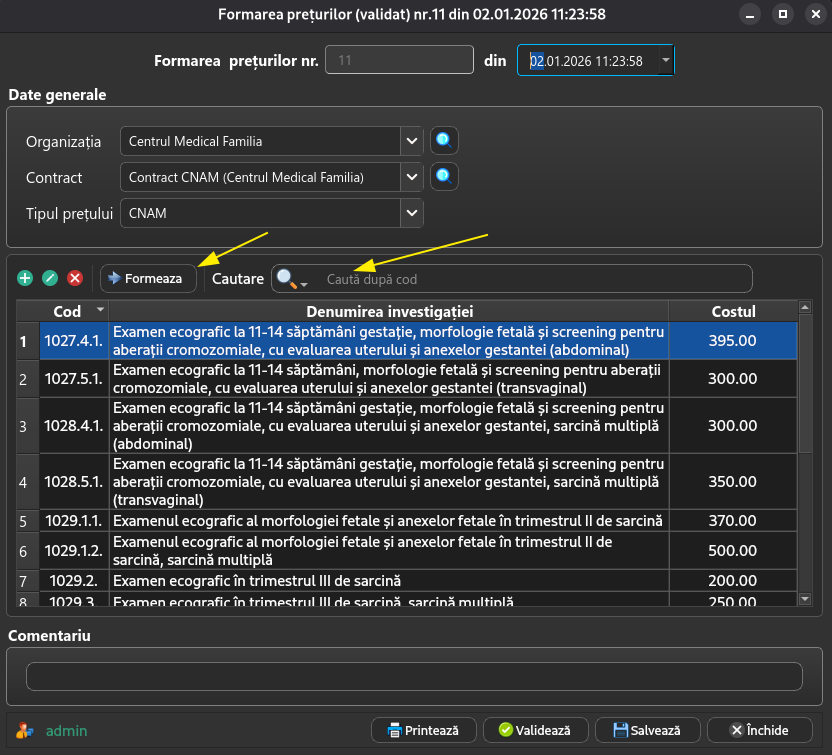

Prețul aplicat unei investigații poate depinde de tipul de preț și
contractul selectat.

------------------------------------------------------------------------

## 19. Rapoarte și statistici

Meniul **Rapoarte** oferă rapoarte statistice, medicale și
administrative disponibile în configurația aplicației.

Pentru formarea unui raport:

1. selectați tipul raportului;
2. stabiliți perioada și parametrii;
3. apăsați **Formează**;
4. verificați rezultatul;
5. tipăriți sau exportați în PDF, dacă este necesar.

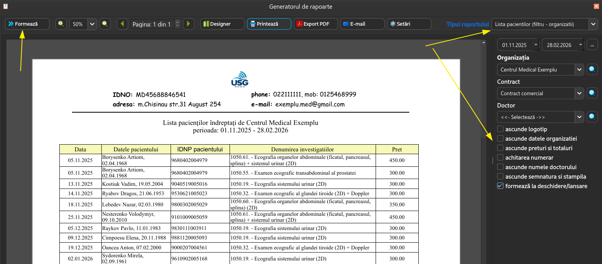

------------------------------------------------------------------------

## 20. Setările aplicației

Deschideți **Setări** din fereastra principală.

Setările sunt grupate pe categorii.

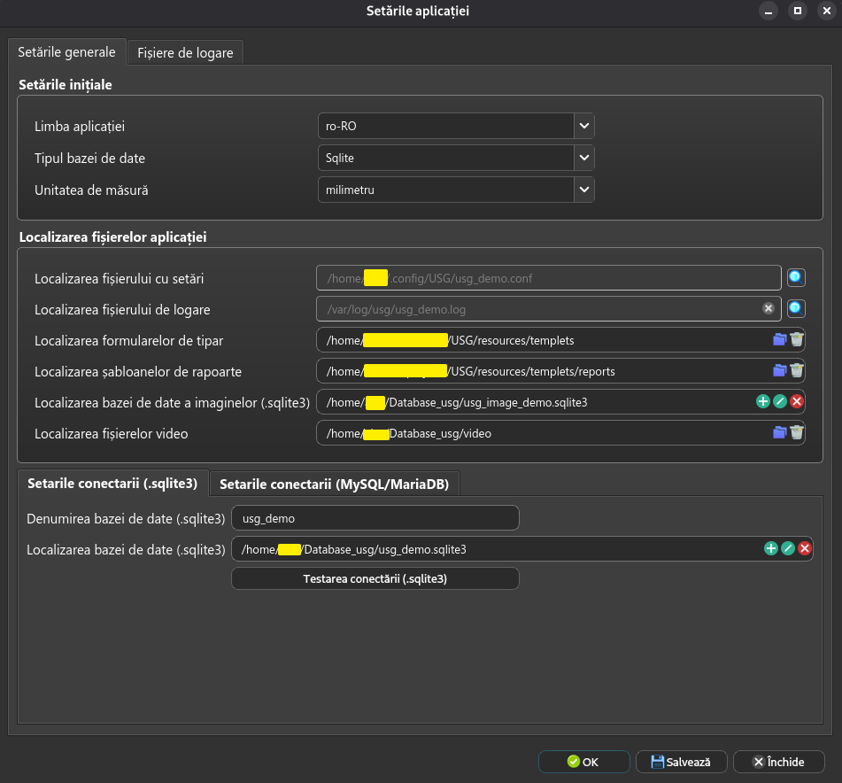

### 20.1. Aplicație

Sunt disponibile opțiuni precum:

- verificarea automată a existenței unei versiuni noi;
- prezentarea automată a manualului utilizatorului;
- prezentarea asistentului aplicației;
- intervalul de actualizare automată a jurnalelor;
- solicitarea confirmării la închiderea aplicației;
- deschiderea documentelor în ferestre separate;
- minimizarea în zona de notificare;
- configurarea meniului de printare.

### 20.2. Organizație

Pot fi configurate:

- marca aparatului;
- organizația implicită/de lucru;
- asistentul medical implicit;
- doctorul implicit;
- logotipul organizației.

### 20.3. Baza de date și fișiere

Setările avansate permit configurarea:

- tipului bazei de date;
- limbii aplicației;
- fișierului de setări;
- formularelor de tipar;
- fișierelor de log;
- șabloanelor de rapoarte;
- bazei de imagini;
- fișierelor video;
- conexiunii SQLite;
- conexiunii MySQL/MariaDB.

> \[!CAUTION\] Modificarea căilor bazelor de date sau parametrilor
> MariaDB poate face datele temporar inaccesibile. Efectuați o copie de
> siguranță înainte de modificări.

### 20.4. Logare

Aplicația permite configurarea păstrării fișierelor de log și filtrarea
după nivelul de logare.

Logurile sunt utile pentru diagnosticarea problemelor, dar înainte de
transmiterea lor verificați să nu conțină date sensibile.

------------------------------------------------------------------------

## 21. SQLite, MariaDB și sincronizare

USG poate lucra cu:

- **SQLite** -- bază locală;
- **MariaDB** -- bază de date de rețea/server.

Un profil SQLite poate fi configurat pentru sincronizare cu MariaDB.

### 21.1. SQLite

SQLite este potrivit pentru lucru local și nu necesită un server
separat.

Datele aplicației și baza imaginilor pot fi stocate în fișiere
distincte.

### 21.2. MariaDB

Pentru MariaDB se configurează:

- hostul;
- baza de date;
- portul;
- opțiunile suplimentare;
- utilizatorul;
- parola.

Utilizați funcția de testare a conexiunii înainte de salvarea
configurației.

### 21.3. Sincronizare

În Setări există opțiunea **Sincronizare cu baza de date cloud**.

Sincronizarea SQLite--MariaDB utilizează identificatori UUID pentru
corelarea înregistrărilor.

> \[!IMPORTANT\] Pentru baze existente, în special după actualizări
> majore, efectuați copii de siguranță înainte de prima sincronizare. Nu
> utilizați simultan versiuni vechi și noi ale USG pe aceeași bază
> migrată.

------------------------------------------------------------------------

## 22. Copii de siguranță

Pentru o instalare în producție trebuie salvate cel puțin:

- baza principală;
- baza imaginilor;
- configurația aplicației;
- fișierele necesare funcționării specifice cabinetului.

Pentru SQLite poate fi activată opțiunea:

**Arhivează automat baza SQLite la închiderea aplicației**.

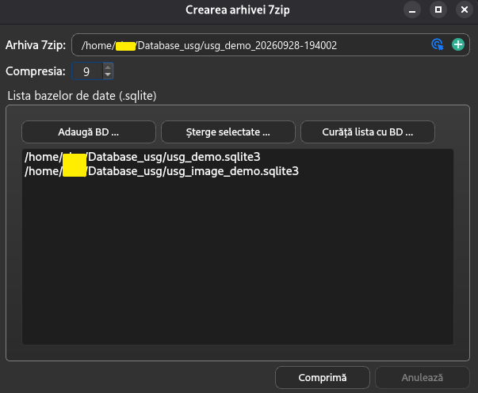

> \[!IMPORTANT\] O copie de siguranță este utilă numai dacă poate fi
> restaurată. Verificați periodic copiile și păstrați cel puțin o copie
> separată de calculatorul de lucru.

### Criptarea arhivei

În dialogul de arhivare poate fi bifată opțiunea **Criptează arhiva cu
parolă**. Arhiva 7z este criptată AES-256, inclusiv lista fișierelor.
Parola (minimum 8 caractere, fără diacritice) se introduce o singură dată
și se salvează criptat pe calculator, pentru arhivarea automată la
închidere. Dacă parola salvată nu este disponibilă, arhivarea automată
se oprește cu un avertisment în jurnal; arhiva nu se creează necriptată.

După creare, fiecare arhivă este verificată automat (`7z t`).

Într-o arhivă criptată pot fi incluse și cheile de criptare
(directorul `crypto`), necesare la mutarea bazei pe alt calculator.

> \[!WARNING\] Fără parolă arhiva nu poate fi restaurată. Notați parola
> într-un loc sigur, separat de calculator.

### Restaurarea din arhivă

1. Închideți aplicația.
2. Extrageți arhiva cu 7-Zip (Windows: meniul contextual **7-Zip →
   Extrage**; Linux: `7z x arhiva.7z`) și introduceți parola, dacă este
   cerută.
3. Copiați bazele `.sqlite3` în locul celor folosite de profil; la nevoie,
   copiați directoarele `crypto` și `settings` în directorul de
   configurare al aplicației.

Pentru calculatoarele cu baze SQLite se recomandă și criptarea discului
(BitLocker pe Windows, LUKS pe Linux).

------------------------------------------------------------------------

## 23. Actualizarea aplicației

USG poate verifica automat existența unei versiuni noi, dacă opțiunea
este activată.

Înainte de actualizare:

1. închideți documentele deschise;
2. efectuați copia bazei principale;
3. efectuați copia bazei imaginilor;
4. salvați configurația;
5. asigurați-vă că ceilalți utilizatori nu lucrează pe baza care
   urmează să fie migrată;
6. instalați versiunea nouă;
7. porniți aplicația și permiteți finalizarea migrării;
8. verificați funcțiile principale înainte de reluarea activității.

### Notă pentru 4.2.9

Versiunea 4.2.9 nu modifică schema bazei de date. Adaugă opțional
SQLCipher pentru baza locală principală și baza imaginilor. SQLite
standard rămâne implicit. Cheia SQLCipher se introduce la lansare și
nu se salvează în profil; fără cheie baza criptată nu poate fi
recuperată. Activarea opțiunii nu convertește automat o bază SQLite
existentă: selectați numai copii criptate și verificate ale ambelor
baze. Instalatoarele Linux și Windows includ pluginul Qt `QSQLCIPHER`
compatibil. Pentru o bază criptată, fereastra „Despre aplicație” afișează
versiunile SQLite, SQLCipher și OpenSSL.

Pentru demonstrații poate fi construit separat un pachet Linux care
configurează automat profilul demo. Acesta folosește utilizatorul
`admin` fără parolă și trebuie distribuit numai după verificarea manuală
a anonimizării tuturor datelor și imaginilor.

### Notă pentru 4.2.8

Versiunea 4.2.8 nu modifică schema bazei de date. În fereastra de
selectare a bazei, butonul **Editează** deschide profilul `.conf`
selectat în editorul sistemului. Au fost corectate alinierea butoanelor
și iconurile mai multor ferestre, adăugate exemple în câmpurile de
configurare MariaDB/cloud/e-mail și actualizată integral traducerea
rusă pentru textele curente.

### Notă pentru 4.2.7

Versiunea 4.2.7 actualizează schema bazei de date (securitatea
conturilor). La prima pornire, migrarea:

- convertește hash-urile parolelor utilizatorilor în PBKDF2-SHA256 cu
  salt; parolele rămân aceleași;
- golește coloana veche cu parola codificată reversibil (baze create
  înainte de 4.1.0);
- recriptează parola serverului cloud cu cheia organizației (parte în
  baza de date, parte într-un fișier local din profil); după
  restaurarea bazei pe alt calculator, parola cloud trebuie
  reintrodusă în configurația serverului cloud;
- face numele utilizatorilor unice, fără diferență între majuscule și
  minuscule; numele duplicate sunt redenumite („nume (2)”), iar lista
  apare în panoul informativ.

Tot în 4.2.7: parole de minimum 8 caractere și pauză după autentificări
nereușite (capitolul 4), arhive criptate cu parolă (capitolul 22),
căutarea și eliminarea pacientului din catalog (capitolul 8), căutarea
după pacient sau investigație în jurnalul comenzilor (capitolul 11) și
forma de tipar a programărilor (capitolul 7).

Pe o bază MariaDB folosită de mai multe stații, actualizați toate
stațiile: versiunile anterioare nu mai pot verifica parolele convertite.

### Notă pentru 4.2.6

Versiunea 4.2.6 nu modifică schema bazei de date. Adaugă trimiterea mai
multor rapoarte ecografice validate într-un singur e-mail către
organizația care a trimis pacienții (vezi secțiunea „Expedierea prin
e-mail”) și ecrane de pornire noi pentru toamnă și primăvară.

### Notă pentru 4.2.5

Versiunea 4.2.5 este o actualizare corectivă, fără modificări ale schemei
bazei de date. La pornire, aplicația verifică dacă fișierele SQLite din
profil există și dacă baza MariaDB conține schema aplicației; în caz
contrar, afișează un mesaj și nu creează baze goale. O bază existentă
aleasă la prima lansare nu mai este recreată.

În jurnalul Comenzilor ecografice au fost corectate ștergerea documentelor
(inclusiv imaginile și copia din cloud), filtrele și sortarea, care se
aplică acum tuturor documentelor din perioada aleasă. Au fost corectate
și exportul pentru e-mail, salvarea documentelor de prețuri și lista
rapoartelor statistice.

Înainte de actualizare, efectuați copiile de siguranță descrise mai sus.

Pentru un profil SQLite sincronizat cu MariaDB, actualizarea trebuie
efectuată cu atenție și numai după realizarea copiilor de siguranță.

------------------------------------------------------------------------

## 24. Scurtături de tastatură

În Raportul ecografic sunt disponibile:

  Acțiune     Scurtătură

  ----------- --------------

  Printează   `Ctrl+P`
  Validează   `Ctrl+Enter`
  Salvează    `Ctrl+S`
  Închide     `Esc`

Aceleași combinații pot fi disponibile și în alte ferestre atunci când
sunt indicate de interfață.

------------------------------------------------------------------------

## 25. Recomandări de utilizare

Pentru un flux de lucru sigur:

1. autentificați-vă cu utilizatorul propriu;
2. verificați organizația și medicul activ;
3. căutați pacientul înainte de a crea unul nou;
4. verificați IDNP și data nașterii atunci când sunt disponibile;
5. selectați investigațiile corecte în Comandă;
6. verificați consimțământul format;
7. completați Raportul numai în secțiunile relevante;
8. verificați concluzia;
9. salvați și validați documentul;
10. verificați previzualizarea înainte de tipărire/PDF;
11. verificați destinatarul înainte de expedierea prin e-mail;
12. efectuați copii de siguranță regulate.

------------------------------------------------------------------------

## 26. Soluționarea problemelor

### 26.1. Aplicația nu se conectează la MariaDB

Verificați:

- adresa serverului;
- portul;
- numele bazei;
- utilizatorul;
- parola;
- accesul de rețea;
- firewall-ul;
- funcția **Testarea conectării**.

### 26.2. Nu apar investigațiile

Verificați dacă clasificatorul **Investigații** a fost încărcat și dacă
grupele de investigații sunt disponibile.

### 26.3. Nu se formează corect consimțământul

Verificați codul investigației și clasificarea acestuia. Consimțământul
este determinat pe baza investigațiilor selectate.

### 26.4. Nu apare Raportul asociat Comenzii

În Jurnalul comenzilor, mesajul **Raport ecografic lipsește** indică
faptul că pentru Comanda selectată nu există încă un Raport asociat.

Deschideți Comanda și utilizați acțiunea **Raport**.

### 26.5. Probleme la tipărire

Verificați:

- șablonul selectat;
- imprimanta;
- organizația;
- doctorul;
- opțiunile de ascundere;
- previzualizarea documentului.

### 26.6. Probleme cu imaginile sau video

Verificați căile configurate pentru:

- baza imaginilor;
- fișierele video.

Nu modificați manual locațiile fișierelor în timpul utilizării
aplicației.

### 26.7. Probleme după actualizare

Nu continuați modificarea bazei dacă migrarea raportează o eroare.

Păstrați:

- copia bazei;
- versiunea USG;
- sistemul de operare;
- tipul bazei (SQLite/MariaDB);
- mesajul de eroare;
- liniile relevante din log, după anonimizare.

------------------------------------------------------------------------

## 27. Confidențialitatea datelor

USG poate stoca date personale și medicale confidențiale.

Respectați regulile organizației și legislația aplicabilă privind:

- accesul la datele pacienților;
- păstrarea bazelor de date;
- copiile de siguranță;
- expedierea prin e-mail;
- transmiterea logurilor;
- capturile de ecran;
- raportarea erorilor.

Nu publicați în GitHub Issues sau în alte servicii publice:

- baze de date reale;
- nume/IDNP ale pacienților;
- rapoarte medicale identificabile;
- imagini medicale identificabile;
- parole;
- credențiale MariaDB/SMTP;
- loguri neanonimizate.

------------------------------------------------------------------------

# Anexa A -- Lista capturilor de ecran

Capturile pot fi păstrate în directorul `docs/screenshots/`.

  Fișier                            Conținut recomandat

  --------------------------------- -------------------------------

  `01-overview.png`                 Vedere generală USG
  `02-startup.png`                  Pornirea aplicației
  `03-first-run-wizard.png`         Asistent configurare inițială
  `04-login.png`                    Autentificare
  `05-main-window.png`              Fereastra principală
  `06-catalogs.png`                 Cataloage
  `07-appointments.png`             Programarea pacienților
  `08-patients.png`                 Evidența pacienților
  `09-patient-history.png`          Istoria pacientului
  `10-order.png`                    Comanda ecografică
  `11-informed-consent.png`         Consimțământ informat
  `12-order-journal.png`            Jurnalul comenzilor
  `13-report.png`                   Raport ecografic
  `14-report-internal-organs.png`   Organe interne
  `15-report-urinary.png`           Sistem urinar
  `16-report-prostate.png`          Prostata
  `17-report-gynecology.png`        Ginecologic
  `18-report-breast.png`            Glandele mamare
  `19-report-thyroid.png`           Glanda tiroidă
  `20-report-pregnancy.png`         Sarcina
  `21-report-soft-tissue.png`       Țesuturi moi / ganglioni
  `22-report-images.png`            Imagini
  `23-report-video.png`             Video
  `24-normograms.png`               Normograme
  `25-report-journal.png`           Jurnalul rapoartelor
  `26-print-preview.png`            Previzualizare / tipărire
  `27-email.png`                    Expediere e-mail
  `28-pricing.png`                  Prețuri
  `29-statistics.png`               Rapoarte/statistici
  `30-settings.png`                 Setări
  `31-backup.png`                   Arhivare / backup

------------------------------------------------------------------------

# Anexa B -- Convenții pentru capturile de ecran

Pentru capturile destinate documentației publice:

- utilizați date fictive;
- ascundeți numele și IDNP-ul pacienților reali;
- nu afișați parole;
- nu afișați adrese SMTP/MariaDB sensibile;
- utilizați aceeași dimensiune a ferestrei pe cât posibil;
- păstrați interfața în limba română pentru versiunea română a
  manualului;
- decupați doar când acest lucru îmbunătățește lizibilitatea.

------------------------------------------------------------------------

## Despre document

Manual pregătit pentru **USG 4.2.9**, pe baza interfeței și
funcționalităților proiectului.

Repository: `debalex77/USG`

Licența aplicației: **GNU GPL v3 sau o versiune ulterioară**.
